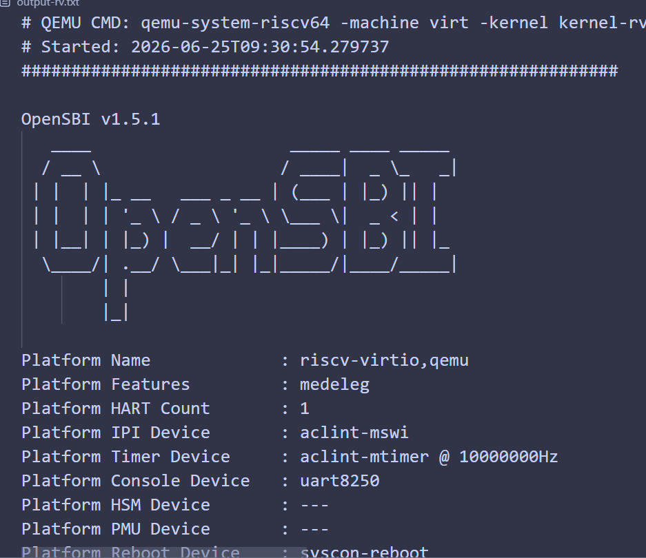
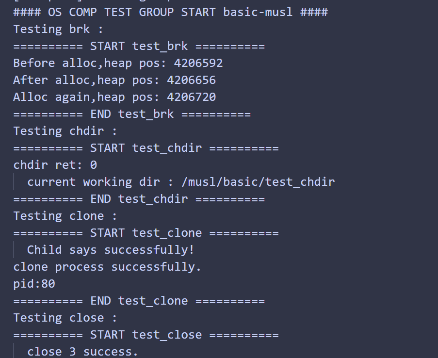
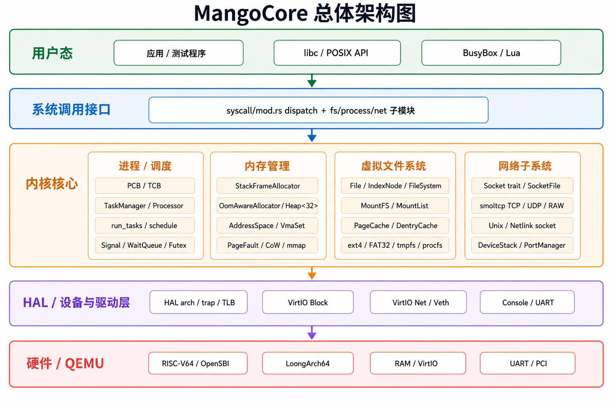
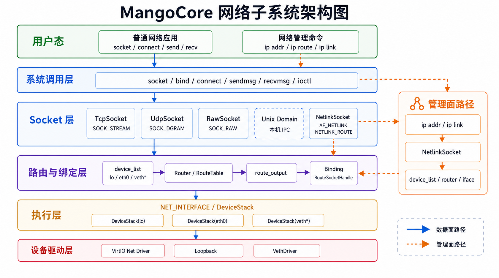
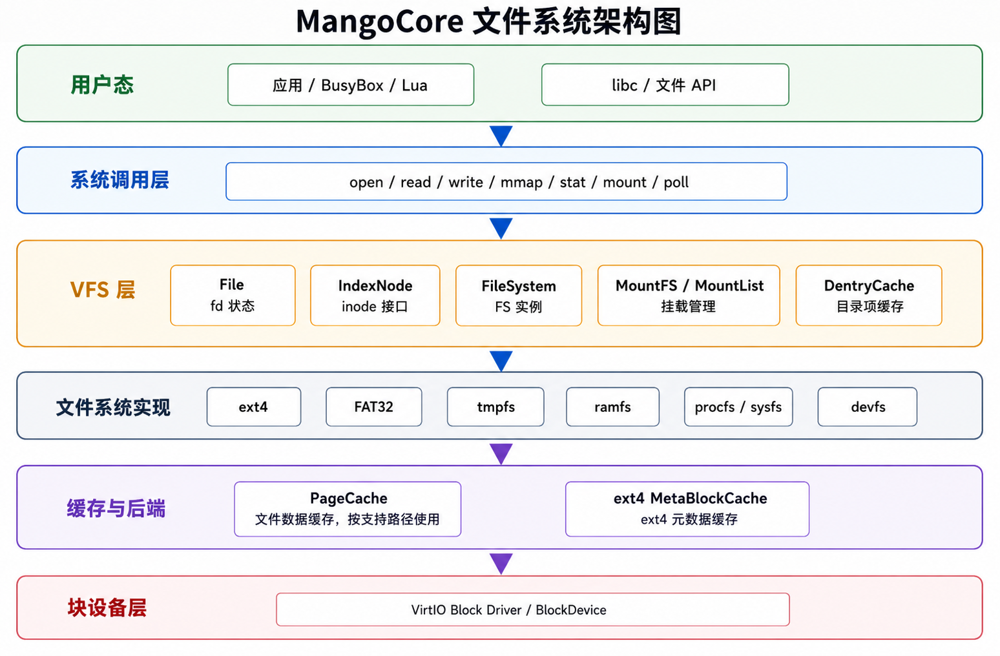

# MangoCore

[](https://github.com/Pan-Peach/MangoCore/actions/workflows/ci-main.yml)
[](LICENSE)


**MangoCore** 是一个 `#![no_std]` 裸机 Rust 内核，支持 **riscv64** 和 **loongarch64** 双架构，在 QEMU/OpenSBI 上运行。项目面向全国大学生操作系统竞赛内核赛道开发，实现了约 218 个 Linux 兼容系统调用，涵盖进程管理、虚拟内存、文件系统、网络、进程间通信和事件通知机制。架构设计参考了 DragonOS 的 VFS/MountFS 设计模式，行为语义以 Linux 6.6 为基准。

**评审材料：** [技术报告](docs/00_overview/Technical-Report-MangoCore.md) · [工程案例手册](docs/00_overview/Engineering-Casebook.md) · [AI 使用报告](docs/00_overview/AI-Usage-Report.md)

---

## 快速开始

所有构建在 Docker 容器内执行，宿主机仅需 Git 和 Docker。

```bash
# 1. 克隆仓库
git clone <repo-url> MangoCore && cd MangoCore

# 2. 进入开发容器
make docker

# 3. 构建完整镜像（内核 + 用户态 + 文件系统）
cd os && make rv64_all

# 4. 在 QEMU 中运行
make rv64-run
```

进入容器后，首次构建需编译内核、用户态程序并打包文件系统镜像，耗时约 1-2 分钟。后续迭代可使用快速编译命令。

**la64 版本：** 将 `rv64_all` / `rv64-run` 替换为 `la64_all` / `la64-run` 即可。

> ⚠️ 双架构使用不同的 Rust nightly 工具链，必须分开串行构建，禁止并行执行。

<div align="center">
  
  
</div>

### 快速迭代（仅编译内核）

```bash
cd os && make rv64-kernel-build-only
cd os && make la64-kernel-build-only
```

### 交互式开发

`make docker` 已附带交互式 shell。退出后重新进入：

```bash
make docker
```

---

## 架构支持

| 架构 | 平台 | 固件 | 块/网 | 运行命令 |
|------|------|------|--------|----------|
| riscv64gc | QEMU virt | OpenSBI | virtio-blk / virtio-net | `make -C os rv64-run` |
| loongarch64 | QEMU virt | QEMU | virtio / PCI | `make -C os la64-run` |

---

## 功能

| 类别 | 主要实现 | 覆盖 |
|------|----------|------|
| 进程 | clone/fork/execve/wait4/signals | LTP process, signal |
| 内存 | SV39 页表, mmap, CoW, MAP_SHARED, zRAM | LTP mmap, munmap, mprotect |
| 文件系统 | ext4, fat32, tmpfs, ramfs, procfs, devfs | LTP open, read, write, stat |
| 网络 | TCP, UDP, RAW, Unix, Netlink, Packet | socket, iperf, netperf |
| IPC | futex, SysV msg/sem/shm | futex, sem, shm |
| 事件 | epoll, eventfd, signalfd, pidfd | epoll, eventfd |
| 定时器 | POSIX timer, nanosleep, clock | timer, nanosleep |
| 系统调用 | 约 218 个 Linux 兼容 syscall | OSComp + LTP |
| 驱动 | virtio-blk, virtio-net, PCI | QEMU 启动 |

---

## 相比基线的增量

MangoCore 基于 [NPUcore-Blossom](https://gitlab.eduxiji.net/educg-group-35806-2894282/oskernel2025-npucore-blossom)（西北工业大学 2025 届 OS 竞赛作品）开发，在以下方面进行了扩展和重构：

| 领域 | NPUcore-Blossom | MangoCore |
|------|----------------|-----------|
| 系统调用 | 100+ | ~218 |
| 网络协议栈 | 未实现 | TCP/UDP/RAW/Unix/Netlink/Packet，iperf/netperf |
| I/O 多路复用 | 未实现 | epoll, eventfd, signalfd, pidfd, timerfd |
| 进程间通信 | 未实现 | SysV msg/sem/shm |
| 文件系统类型 | ext4, fat32 | ext4, fat32, tmpfs, ramfs, procfs, devfs, sysfs |
| VFS 架构 | 基础 VFS | DragonOS 启发式 MountFS + 挂载传播 + 目录项缓存 |
| 网络诊断 | 无 | /proc/net/tcp, /proc/net/udp, /proc/net/dev 等 |
| 内核诊断 | 无 | /proc/[pid]/*, /sys/kernel/stats, heap_trace |
| LTP 测试覆盖 | basic/busybox/lua/libctest/lmbench | 额外支持 iperf/netperf/cyclictest 等 |
| 模块文档 | 少量 Markdown | 覆盖架构、系统调用、文件系统、内存管理、进程调度、网络、驱动、调试各子系统 |

---

## 测试

### 快速冒烟

```bash
cd os && make rv64-run
```

### 测试配置

由 `os_test.conf` 的 `mask` 字段控制（12-bit）：

| 掩码 | 测试组 |
|------|--------|
| `0x001` | basic（冒烟） |
| `0x003` | basic + busybox |
| `0x800` | LTP |
| `0xFFF` | 全量（最终评测用，耗时较长） |

### 准备测试镜像

```bash
make testsuits-download
xz -dkc fs-img-dir/sdcard-rv.img.xz > sdcard-rv.img
xz -dkc fs-img-dir/sdcard-la.img.xz > sdcard-la.img
```

### 全量自动化测试

```bash
python3 scripts/run_full_test.py         # 一键双架构全量
```

### 注入自定义测试配置

```bash
make -C os conf-inject CONF_ARCH=rv64 CONF_BLK_MODE=virt CONF_FILE=../os_test.conf
```

---

## 架构概览



- **HAL 层**隔离 riscv64 和 loongarch64 的架构相关代码（陷阱处理、页表、TLB、控制寄存器）
- **VFS/MountFS** 采用 DragonOS 启发的分层设计：`File` → `IndexNode` → `FileSystem` → `MountFS` → `PageCache`
- **系统调用分发** 将约 218 个系统调用路由到进程、内存、文件系统、网络等子模块

<div align="center">
  
  
</div>

详细架构见[技术报告](docs/00_overview/Technical-Report-MangoCore.md)。

---

## 项目结构

```
os/                内核源码（#![no_std]）
user/              用户态程序和 C 库
docs/              评审报告、子系统文档、测试映射
scripts/           构建、测试和分析脚本
cargo-config/      锁定工具链版本的 cargo 配置
Makefile           顶层构建编排
docker-compose.yml 开发容器配置
```

---

## 文档

- **评审材料：** [技术报告](docs/00_overview/Technical-Report-MangoCore.md) · [工程案例手册](docs/00_overview/Engineering-Casebook.md) · [AI 使用报告](docs/00_overview/AI-Usage-Report.md)
- [文档索引](docs/README.md) — 所有模块文档的入口
- [测试映射](docs/ltp/) — LTP 和 OSComp 测试覆盖详情
- [开发日志](docs/Work_Log.md) — 变更记录与调试总结

---

## 开发注意事项

- **Docker 是唯一构建环境**，宿主机只需 Git 和 Docker
- **禁止并行构建双架构** — 工具链 nightly 版本不同，必须串行
- **快速验证：** `make -C os rv64-kernel-build-only`（仅内核，约 20s）
- **双架构编译验证：** 每次变更后执行 `make -C os rv64-kernel-build-only && make -C os la64-kernel-build-only`
- 详细开发工作流（TLB 刷新、锁约定、errno 约定等）见项目根目录 `AGENTS.md`

---

## 参考资料

- [NPUcore-Blossom](https://gitlab.eduxiji.net/educg-group-35806-2894282/oskernel2025-npucore-blossom) — 本项目基线（西北工业大学 2025 届 OS 竞赛作品）
- [DragonOS](https://github.com/DragonOS-Community/DragonOS) — VFS/MountFS 架构参考
- [smoltcp](https://github.com/smoltcp-rs/smoltcp) — TCP/IP 协议栈
- [virtio-drivers](https://github.com/rcore-os/virtio-drivers) — Virtio 设备驱动
- Linux 6.6 — 系统调用语义参考
- [OS 竞赛历届优秀作品](https://github.com/oscomp/os-competition-info/blob/main/os-kernel-winners.md)
