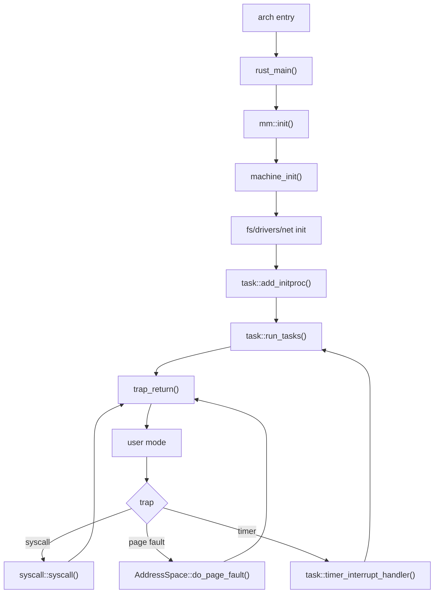

# 启动与陷阱路径

## 1. 概述

启动路径描述内核从架构 entry 进入 `rust_main()`，再创建 init 任务并进入调度器的过程；陷阱路径描述用户态 syscall、缺页、timer interrupt 和异常如何回到内核。两者在 `task::run_tasks()` 与 `trap_return()` 处闭合：

```
firmware / QEMU / OpenSBI
        |
        v
arch entry asm
        |
        v
main.rs::rust_main()
        |
        v
task::run_tasks()
        |
        v
trap_return() -> user
        |
        v
trap_handler() -> syscall/MM/task
```

该页按控制流组织。syscall 编号和错误码见 `docs/02_syscall/`，缺页动作分类见 `docs/04_mm/page-fault-and-usercopy.md`，调度实体见 `docs/05_process/`。

## 2. 启动入口文件

| 架构/feature | `main.rs` 引入的汇编段 |
|--------------|------------------------|
| rv64 | `hal/arch/riscv/entry.asm` |
| initramfs + rv64 | `initramfs-rv.S` |
| initramfs + la64 | `initramfs-la.S` |
| block_mem + rv64 | `load_img-rv.S` |
| block_mem + la64 | `load_img.S` |
| preload_payloads + rv64 | `preload_app-rv.S` |
| preload_payloads + la64 | `preload_app.S` |

`main.rs` 中 la64 entry 的 `global_asm!` 行处于注释状态；la64 的实际入口由该架构构建链路脚本和后端文件承担。文档只记录 `main.rs` 当前显式引入的段。

## 3. `rust_main()` 控制流

### 3.1 固定前缀

```
bootstrap_init()
mem_clear()
move_to_high_address()        [block_mem]
console::log_init()
trace::init()
mm::init()
machine_init()
task::timer_subsystem_init()
```

| 步骤 | 关键结果 |
|------|----------|
| `bootstrap_init()` | 架构早期机器状态准备；la64 配置 exception/TLB/page walk/DMW |
| `mem_clear()` | 清零 BSS 或 `sbss..MEMORY_END` |
| `move_to_high_address()` | `block_mem` 下复制内嵌根文件系统镜像 |
| `console::log_init()` | 日志输出可用 |
| `trace::init()` | trace 基础设施可用 |
| `mm::init()` | heap、frame allocator、内核页表可用 |
| `machine_init()` | trap entry 和 timer interrupt 可用 |
| `task::timer_subsystem_init()` | task 层 timeout/wakeup 设施可用 |

### 3.2 initramfs 分支

```
fs::vfs::posix_lock::init_posix_lock_manager()
fs::initramfs_init()
drivers::init_net_device()
net::config::init()
fs::mount_boot_block_devices()
fs::install_preload_payloads()       [preload_payloads]
```

该分支先建立 initramfs 根，再初始化网络设备与网络配置，随后探测启动块设备。`main.rs` 注释说明块设备探测需要连续物理页 DMA，因此放在 payload 安装之前。

### 3.3 legacy 分支

```
drivers::init_net_device()
net::config::init()
fs::flush_preload()
fs::mount_tools_disk()
```

legacy 分支不调用 `fs::initramfs_init()`。`block_virt`、`oom_handler`、`heap_trace` feature 会在该分支输出对应启用信息。

### 3.4 统一后缀

```
fs::vfs::posix_lock::init_posix_lock_manager()
task::add_initproc()
task::run_tasks()
```

`task::add_initproc()` 触发 `INITPROC` lazy 构造，优先加载 `/init`，失败后加载 `/initproc`。创建初始任务后，`task::run_tasks()` 进入调度主循环。

## 4. 从调度器到用户态

调度器选中任务后，通过架构上下文切换和 trap return 回到用户态：

```
TaskManager::fetch()
        |
        v
Processor.current = task
        |
        v
__switch(idle_task_cx, next_task_cx)
        |
        v
trap_return()
        |
        v
__restore / trampoline
        |
        v
user pc
```

具体 `run_tasks()` 还会在选择任务前执行过期 timer 唤醒、网络 poll、FS reclaim、zombie 回收和 shared futex compact。这些维护动作属于调度循环的一部分，而不是启动阶段一次性动作。

## 5. syscall 路径

```
user code
  a7 = syscall id
  a0..a5 = args
      |
      v
trap_handler()
  pc += 4
  origin_a0 = a0
      |
      v
syscall::syscall(id, args)
      |
      v
sys_xxx()
      |
      v
trap_return()
```

| 项 | rv64 | la64 |
|----|------|------|
| syscall trap | `Exception::UserEnvCall` | `Exception::Syscall` |
| PC 前进 | `cx.gp.pc += 4` | `ERA::next_ins()` + `cx.gp.pc += 4` |
| 参数 | `a7`, `a0..a5` | `a7`, `a0..a5` |
| 返回寄存器 | `a0` | `a0` |
| `rt_sigreturn` | id 139 不覆盖 `a0` | id 139 不覆盖 `a0` |

`syscall::syscall()` 内部还执行 seccomp 检查、日志、性能计数、未知 syscall 的 `ENOSYS` 返回。

## 6. 缺页路径

```
instruction/load/store fault
        |
        v
trap_handler()
        |
        v
FaultAccess::{Execute, Load, Store}
        |
        v
task.process.vm().lock().do_page_fault(addr, access)
        |
        v
AddressSpace / VmaSet / page_fault
        |
        v
lazy alloc / filemap / shared write / CoW
```

缺页失败后的信号映射：

| MM 错误 | 用户可见结果 |
|---------|--------------|
| `BeyondEOF`, `BackingStoreFailure` | `SIGBUS` |
| `NoPermission` | `SIGSEGV` + `SEGV_ACCERR` |
| `BadAddress`, `NotMapped` | `SIGSEGV` + `SEGV_MAPERR` |
| `OutOfMemory` | `pending_oom_kill = true` |

la64 的 store/page modify 缺页成功后还会补 dirty bit，避免写权限已经恢复但硬件 dirty 状态缺失。

## 7. timer interrupt 路径

### 7.1 trap 分支

| 架构 | timer trap | trap 层动作 |
|------|------------|-------------|
| rv64 | `Interrupt::SupervisorTimer` | 记录 timer interrupt 和调度统计，调用 `task::timer_interrupt_handler()` |
| la64 | `Interrupt::Timer` | 清 timer 中断状态，记录统计，调用 `task::timer_interrupt_handler()` |

### 7.2 task 层作用

timer interrupt 进入 task 层后推动抢占、timeout 和唤醒逻辑。`run_tasks()` 主循环中的 `do_wake_expired()` 会处理到期等待者，因此 sleep、futex timeout、poll/select timeout 等都依赖这条路径。

## 8. 普通异常路径

| 异常 | rv64 行为 | la64 行为 |
|------|-----------|-----------|
| illegal instruction | 注入 `SIGILL` | 注入 `SIGILL` |
| FPU unavailable / privilege illegal | 未作为单独分支列出 | 注入 `SIGILL` |
| address error | 未作为单独分支列出 | 注入 `SIGSEGV` |
| address not aligned | 未接入模拟分支 | 解码并模拟用户 load/store |
| 未支持 trap | panic | 未匹配分支进入后续诊断或 panic |

trap 后端只处理架构入口和信号注入；信号队列、signal frame、`rt_sigreturn` 的语义由 task/signal 模块实现。

## 9. 返回用户态路径

### 9.1 rv64

```
do_signal()
set_user_trap_entry(TRAMPOLINE)
restore_va = __restore - __alltraps + TRAMPOLINE
fence.i
jr restore_va(a0=trap_cx_user_va, a1=user_satp)
```

### 9.2 la64

```
do_signal()
set_user_trap_entry(strampoline)
PrMd.pplv = 3
PrMd.pie = true
__restore(trap_cx, token, asid)
```

两套路径的共同点是：信号处理一定发生在恢复用户上下文之前。

## 10. 控制流图



这张图的读法是：启动路径只负责把第一个用户任务送进调度器；进入用户态后，内核主要通过 trap 回来。syscall、page fault 和 timer interrupt 都会回到架构后端，但它们很快分流到 syscall、MM 和 task 三个领域模块。领域模块处理完后，要么通过 `trap_return()` 回到用户态，要么通过调度路径切换到另一个任务。

如果系统“看起来卡住”，先判断卡在图中的哪条边：没有进入 `rust_main()` 是入口/链接/平台问题；没有到 `task::run_tasks()` 是初始化问题；进入用户态后每次 syscall 失败是分发或领域实现问题；timer 分支不回到 G 则是中断/调度问题；page fault 一直回不到 H 通常是 MM 权限、PTE 或 TLB 问题。

## 11. 调试与测试

| 目标 | 检查点 | 测试入口 |
|------|--------|----------|
| 启动顺序 | `rust_main()` 输出位置 | `make rv64-run` / `make la64-run` |
| syscall entry | trap handler 中 syscall 分支 | basic syscall、LTP syscall |
| 缺页 | `do_page_fault()` 返回值 | mmap/fork/exec/page fault 用例 |
| timer | timer interrupt 分支 | nanosleep、futex timeout、timer syscall |
| 返回用户态 | `trap_return()` 和恢复汇编 | init 进程启动、busybox shell |

## 12. 源文件索引

| 路径 | 内容 |
|------|------|
| `os/src/main.rs` | `rust_main()`、feature 汇编段、启动分支 |
| `os/src/hal/arch/riscv/entry.asm` | rv64 架构入口 |
| `os/src/hal/arch/riscv/trap/mod.rs` | rv64 trap/syscall/page fault/timer/return |
| `os/src/hal/arch/loongarch64/mod.rs` | la64 bootstrap/machine init |
| `os/src/hal/arch/loongarch64/trap/mod.rs` | la64 trap/syscall/page fault/timer/unaligned access |
| `os/src/syscall/mod.rs` | syscall 分发、seccomp、统计 |
| `os/src/mm/address_space.rs` | `do_page_fault()` |
| `os/src/task/processor.rs` | `run_tasks()` |
| `os/src/task/mod.rs` | `INITPROC`、`add_initproc()` |
